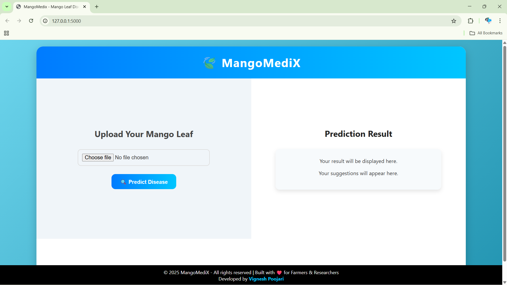
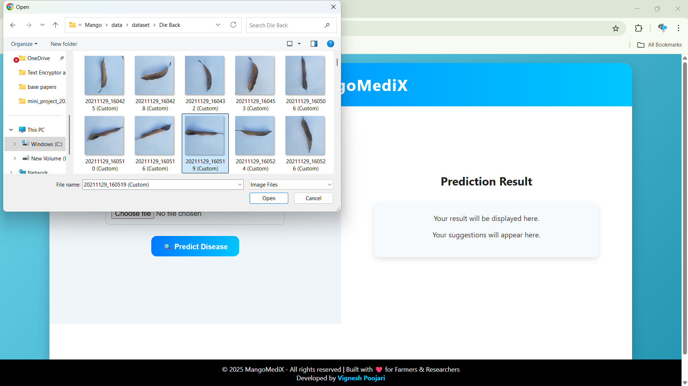
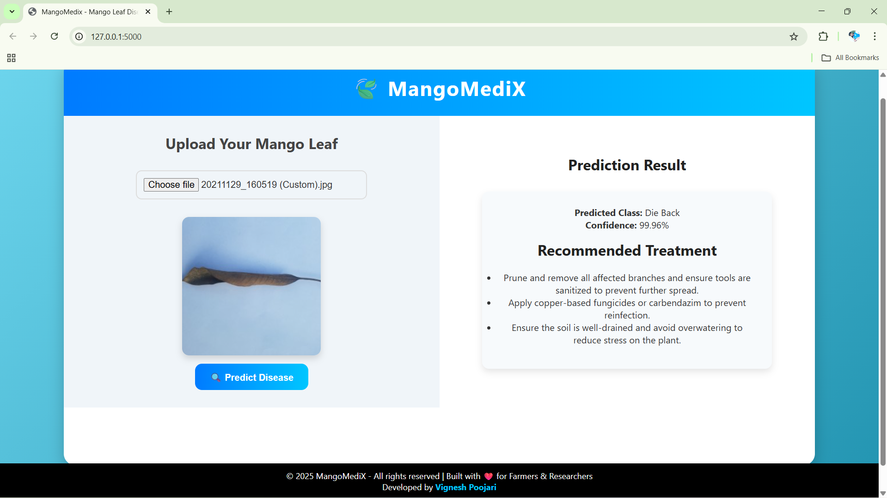

# 🌿MangoMediX 
**AI-Powered Mango Leaf Disease Prediction System**  

MangoMediX is a deep learning–based web application that predicts mango leaf diseases from uploaded images.  
With an accuracy of **92%**, it empowers farmers and researchers with **real-time diagnosis** and **actionable treatment recommendations**, reducing reliance on manual inspections.  

---

## ✨ Features
- 📸 Upload mango leaf images via a clean web interface  
- 🤖 Predicts 8 mango leaf conditions:
  - Anthracnose  
  - Bacterial Canker  
  - Cutting Weevil  
  - Die Back  
  - Gall Midge  
  - Healthy  
  - Powdery Mildew  
  - Sooty Mould  
- 📊 Displays prediction confidence score  
- 💡 Provides disease-specific treatment suggestions  
- 🖥️ User-friendly, responsive design  
- 🧠 Model built on **ResNet50 transfer learning** with TensorFlow/Keras  

---

## 🛠️ Tech Stack
- **Frontend:** HTML, CSS, JavaScript  
- **Backend:** Python, Flask, Flask-CORS  
- **Deep Learning:** TensorFlow, Keras, ResNet50 (Transfer Learning)  
- **Storage/Reports:** JSON (training history & evaluation metrics)  

---

## ⚙️ Setup Instructions

1. **Clone the repository**
   - git clone https://github.com/vignesh-p3007/MangoMedix.git
   - cd MangoMedix

2. **Create a virtual environment (recommended)**
     - python -m venv venv
     - source venv/bin/activate   # for Linux/Mac
     - .\venv\Scripts\activate    # for Windows

3. **Install dependencies**
     - pip install -r requirements.txt

4. **Run the web app**
      - python backend/app.py

5. **Access in browser**
      - http://127.0.0.1:5000/
    
---

## Screenshots

Here are some screenshots of the MangoMedix web application:

### 1. Home Page


### 2. Upload Leaf Image


### 3. Prediction Result


---

### Pre-trained Model

The trained model `disease_detector.h5` (~271 MB) is hosted externally due to GitHub file size limits.  

**Download the model here:** [Google Drive Link](https://drive.google.com/file/d/1IR_KaRTu36PF7MKqXWnoakgL6z2iGNpX/view?usp=drive_link)  

**Instructions:**
1. Download the `disease_detector.h5` file from the link above.
2. Place the file in the `backend/` folder of the MangoMedix project.
3. Run the web application as usual:
```bash
python backend/app.py

---

Demo

Watch the MangoMedix web app in action:

**Demo Video:** [Click Here to View](https://drive.google.com/file/d/1vjyj6GXkkCFYufw_3UGDOo0Vt-6c4dT2/view?usp=drive_link)

---

📊 Results & Accuracy

- Achieved 92% prediction accuracy using ResNet50 with transfer learning
- Early detection helps prevent disease spread and optimize resource usage
- Scalable to larger datasets and adaptable for other crops

---

🚀 Future Improvements

- Expand dataset to include more diseases
- Mobile-friendly version for farmers
- Deploy on cloud (Render, Hugging Face Spaces, or AWS)
- Add notifications for disease alerts
- Multilingual support

---

📜 License

This project is licensed under the MIT License.

---

## 👨‍💻 Authors

- [Vignesh](https://www.linkedin.com/in/vignesh-p3007)  
- [Kshitij R Amin](https://www.linkedin.com/in/kshitij-amin-9a2274208/)  
- [Nitheesh Ishwar Naik](#)  
- [Suhas S](https://www.linkedin.com/in/suhas-s-2773082a6/)  

**Guided by:** Mrs. Usha C S, Assistant Professor, AJIET Mangalore
